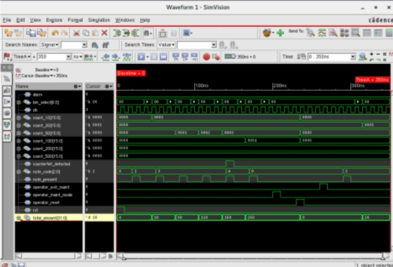
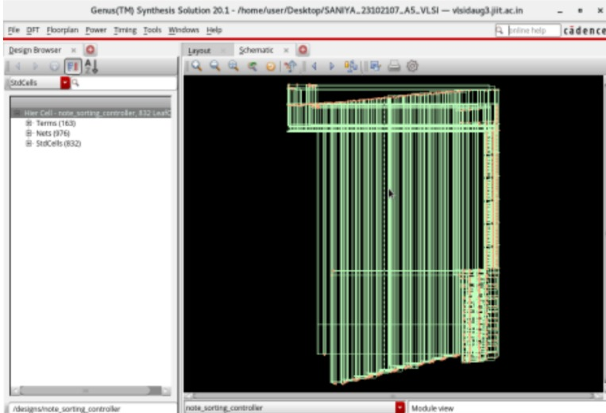
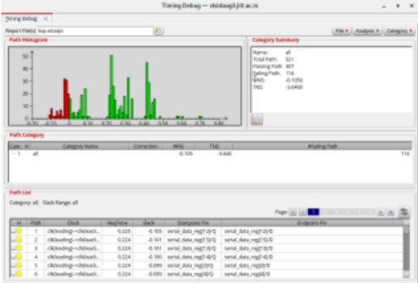

# 🚀 Currency Note Sorting Controller (RTL to GDSII)

## 📌 Overview
This project implements an FSM-based controller for an automated currency note sorting machine. The design is written in Verilog and taken through a complete ASIC design flow from RTL to GDSII using industry-standard Cadence tools.

---

## ⚙️ Features
- Mealy FSM-based control logic for fast and responsive operation  
- Sorting of ₹10–₹500 notes into dedicated bins  
- Counterfeit detection with alarm signal  
- Maintenance/override mode for manual testing and debugging  
- Real-time counters and total amount calculation  

---

## 🏗️ Design Flow
1. RTL Design (Verilog)  
2. Functional Simulation (Cadence SimVision)  
3. Synthesis (Cadence Genus)  
4. Physical Design (Cadence Innovus)  
5. Static Timing Analysis (Cadence Tempus)  
6. GDSII Generation  

---

## 📊 Results
- ✔️ Successful FSM verification through simulation waveforms  
- ✔️ No timing violations after Static Timing Analysis  
- ✔️ Evaluated area, power, and timing performance  

---

## 🖼️ Key Outputs

### Waveform (Simulation)

### Layout (Physical Design)

### Timing Report

---

## 🛠️ Tools Used
- Verilog HDL  
- Cadence Genus  
- Cadence Innovus  
- Cadence SimVision  
- Cadence Tempus  

---

## 📚 Learnings
- FSM design and datapath separation  
- Complete ASIC design flow (RTL → GDSII)  
- Functional verification and debugging  
- Timing closure and optimization  

---

## 🚀 Future Improvements
- Integration with real hardware sensors (IoT-based system)  
- Advanced counterfeit detection using ML  
- Optimization for low power design  

---

## ⭐ Keywords
`Verilog` `VLSI` `ASIC Design` `FSM` `RTL to GDSII` `Cadence` `Digital Design`

---

## 👩‍💻 Author
Munmmun Garg (www.linkedin.com/in/munmun-garg-442159290)
